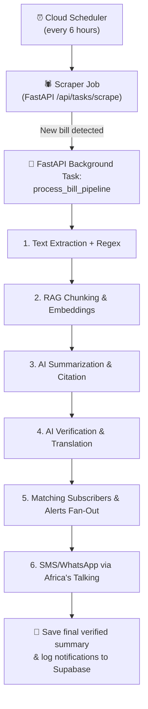

# KeLegislate Buildathon — Requirements Analysis & Production Architecture (v3)

> **Context**: KeLegislate demonstrates financial impact modelling and SMS alerts using the DeepSeek. This document analyses the prototype, identifies every gap, and proposes a production-grade architecture.
>
> **v2 Updates**: Incorporates all user feedback — model split (Gemini 2.5 Flash + 3.5 Flash), calculator tool for agents, Africa's Talking with WhatsApp, Next.js frontend, Supabase free tier, responsible computing framework, and data minimization architecture.
>
> **v3 Updates**: Addresses architectural concerns — LlamaParse for complex PDF parsing (one-time ingestion cost), auth required for feedback submission (anti-astroturfing), custom user business profiles with encrypted persistence, VPS as hosting contingency, Supabase storage monitoring, and revised responsible computing posture.

---

## 1. Current System Audit

### 1.1 Branch Inventory

| Branch | Purpose | State |
|---|---|---|
| `main` | Production-ready merged code | ✅ Full codebase (all 9 source files) |
| `deepseek` | Skeleton / initial scaffold | Stub `main.py` only — all real code is on `main` |
| `sms-alerts` | Skeleton / initial scaffold | Same stub as deepseek |
| `v2` | Skeleton / initial scaffold | Same stub as deepseek |

> [!NOTE]
> All meaningful code lives on the `main` branch. The `deepseek`, `sms-alerts`, and `v2` branches contain only the boilerplate scaffold (14-line `main.py`). The working prototype was developed and committed directly to `main`.

### 1.2 Current Tech Stack

| Layer | Technology | File(s) |
|---|---|---|
| **Frontend / UI** | Streamlit (monolithic Python script) | [main.py](file:///c:/git/KeLegislate/src/main.py) |
| **AI Model** | DeepSeek V4 Flash via OpenAI-compatible API | [llm_utils.py](file:///c:/git/KeLegislate/src/llm_utils.py) |
| **SMS** | Africa's Talking (Sandbox) | [sms_utils.py](file:///c:/git/KeLegislate/src/sms_utils.py) |
| **Database** | Firebase Firestore (NoSQL) | [feedback_utils.py](file:///c:/git/KeLegislate/src/feedback_utils.py) |
| **Scraping** | BeautifulSoup + requests | [scraper.py](file:///c:/git/KeLegislate/src/scraper.py) |
| **PDF Extraction** | pdfplumber + PyTesseract OCR | [pdf_utils.py](file:///c:/git/KeLegislate/src/pdf_utils.py) |
| **Business Profiles** | Hardcoded Python dicts | [hustle_profiles.py](file:///c:/git/KeLegislate/src/hustle_profiles.py) |

### 1.3 Current Capabilities (What Works)

1. **Bill scraping** from parliament.go.ke — finds PDF links, deduplicates by URL
2. **PDF text extraction** — digital-first with OCR fallback (Tesseract)
3. **AI summarization** — English + Swahili summary with industry auto-tagging
4. **Financial impact modelling** — personalized KES-denominated analysis per hustle profile
5. **Citizen feedback** — structured form → Firestore (support, rating, concerns)
6. **Insights dashboard** — pie charts, bar charts, word cloud, AI-generated policy insights
7. **SMS alerts** — single alert + broadcast by industry tag, E.164 phone normalization
8. **Caching** — Firestore bill cache + Streamlit `st.cache_data` for LLM responses
9. **Demo seeder** — Motor Vehicle Circulation Tax Bill pre-loaded for demos

---

## 2. Gap Analysis — Decisions Made

### GAP 1: AI Model Strategy ✅ DECIDED

**Current state**: DeepSeek V4 Flash (`deepseek-v4-flash`) at `$0.14/$0.28` per 1M tokens

**Problems identified**:
- ❌ Swahili translations are **lacklustre** — grammatically awkward, sometimes inconsistent terminology
- ❌ Financial calculations are **unverified** — the model generates numbers with no cross-checking
- ❌ Percentages cited from bills are **not validated** against the source text
- ❌ Single-shot prompting — no chain-of-thought, no tool use, no self-verification
- ❌ 30,000 character truncation in [llm_utils.py:96](file:///c:/git/KeLegislate/src/llm_utils.py#L96) means long bills lose content

**Decision — Split model strategy with calculator tool**:

| Model | Use Cases | Price (1M tokens In/Out) |
|---|---|---|
| **Gemini 2.5 Flash** | Summarization, translation, industry tagging, general bill analysis | $0.30 / $2.50 |
| **Gemini 3.5 Flash** | Generating calculation formulae, financial reasoning, verification of formulae & reasoning | $1.50 / $9.00 |

**Calculator Tool**: A deterministic Python calculator function will be made available to the Financial Impact Agent via tool/function calling. This means:
- ✅ The agent uses Gemini 3.5 Flash to **reason about which formula to apply** and **which values from the bill to use**
- ✅ All actual arithmetic is performed by a **deterministic Python function** (no LLM math)
- ✅ A **Verification Agent** (also Gemini 3.5 Flash) reviews the formulae, the reasoning, the accuracy of values extracted from the bill, and their correct application to the user's context. The agent performs an explicit checklist check:
  - **Min/Max Caps:** Verifying that a tax cap was not missed (e.g., "The tax is 2.5%, but shall not exceed KES 5,000").
  - **Threshold Triggers:** Ensuring the tax is only applied if the user's profile exceeds target thresholds (e.g., "Only applies to businesses with revenue over KES 1,000,000").
  - **Temporal Validity:** Ensuring the tax is effective for the targeted period (e.g., "Effective January 1, 2027" vs "Effective immediately").
  - **Exemptions:** Verifying that explicit exemptions (such as electric vehicles or agricultural goods) are correctly evaluated.
- ✅ No separate "Calculation Verifier" agent needed — the calculator tool guarantees arithmetic correctness

```python
# Example: Calculator tool available to the Financial Impact Agent
def calculate(expression: str) -> dict:
    """
    Deterministic calculator tool for the AI agent.
    Safely evaluates mathematical expressions — no eval().
    
    Args:
        expression: Math expression like "150000 * 0.025 / 12"
    
    Returns:
        {"result": 312.5, "expression": "150000 * 0.025 / 12"}
    """
    # Uses ast.literal_eval or a safe math parser — never eval()
    import ast
    import operator
    
    ops = {
        ast.Add: operator.add, ast.Sub: operator.sub,
        ast.Mult: operator.mul, ast.Div: operator.truediv,
        ast.Pow: operator.pow, ast.USub: operator.neg,
    }
    
    def _eval(node):
        if isinstance(node, ast.Constant):
            return node.value
        elif isinstance(node, ast.BinOp):
            return ops[type(node.op)](_eval(node.left), _eval(node.right))
        elif isinstance(node, ast.UnaryOp):
            return ops[type(node.op)](_eval(node.operand))
        raise ValueError(f"Unsupported expression: {ast.dump(node)}")
    
    tree = ast.parse(expression, mode='eval')
    result = _eval(tree.body)
    return {"result": round(result, 2), "expression": expression}
```

---

### GAP 2: SMS & Notification Provider ✅ DECIDED

**Current state**: Africa's Talking Sandbox — messages are 480 chars max (3 segments), sandbox-only credentials

**Problems identified**:
- ❌ Sandbox mode — won't deliver to real users
- ❌ No message templates or rich formatting
- ❌ No delivery receipts tracked in the system
- ❌ No opt-out/unsubscribe mechanism (regulatory risk under Kenya's Data Protection Act 2019)
- ❌ Sequential sending in [sms_utils.py:134-152](file:///c:/git/KeLegislate/src/sms_utils.py#L134-L152) — will timeout at scale
- ❌ No WhatsApp or USSD channel
- ❌ **Twilio OTP blocking** — Twilio SMS to Kenyan (+254) networks is frequently blocked or delayed by carrier spam filters.

**Decision — Africa's Talking (Live) for all channels, including Custom SMS OTP Webhook & Local Testing Bypass**:

To avoid Twilio's high latency and carrier blocking on Kenyan numbers (+254), we will replace Twilio with **Africa's Talking SMS API** for delivering OTP messages. This will be integrated into Supabase Auth using a **Custom SMS Provider Webhook** targeting our FastAPI backend. Additionally, to guarantee demo resilience, a local testing bypass code (e.g., configuring specific test phone numbers like `+254700000000` with a fixed OTP like `123456`) will be set up in Supabase Auth.

Users choose to receive alerts on one or both channels:

| Channel | Provider | Capability | User Choice |
|---|---|---|---|
| **SMS** | Africa's Talking (Live) | Plain text alerts, works without internet | ✅ Opt-in |
| **WhatsApp** | Africa's Talking WhatsApp API | Rich formatting (bold, lists, links), interactive buttons, images | ✅ Opt-in |
| **USSD** | Africa's Talking USSD | Subscription management without internet/smartphone | Future phase |

#### Registration Requirements for Students (Africa's Talking)

| Requirement | SMS (Sandbox) | SMS (Live) | WhatsApp API | USSD |
|---|---|---|---|---|
| **Account creation** | Name + email only | Name + email only | Name + email only | Name + email only |
| **Business registration docs** | ❌ Not needed | ❌ Not needed (shared short code) | ⚠️ **Yes** — needs Meta Business Manager verification + business docs | ⚠️ **Yes** — needs CAK registration + operator agreements |
| **Cost to start** | Free | Top-up balance (KES ~500 minimum) | Varies by BSP setup | Setup fees + monthly charges |
| **Student-friendly?** | ✅ Fully | ✅ Fully | ⚠️ Moderate — Meta verification is the blocker | ❌ Complex |

#### How Students Demo WhatsApp (Without Full Business Verification)

Meta provides a **test/sandbox mode** that students can use immediately — no business documents needed:

| Step | What to Do |
|---|---|
| 1. **Register** | Create a free account at [developers.facebook.com](https://developers.facebook.com/) |
| 2. **Create App** | Select "Connect with customers through WhatsApp" use case |
| 3. **Get Credentials** | Dashboard gives you: Temporary Access Token, Phone Number ID, WhatsApp Business Account ID |
| 4. **Test** | Send messages to your own phone number using the API — no approval needed |
| 5. **Limits** | Up to **250 unique recipients/day** in unverified mode — enough for any demo or buildathon |

**This is how other hackathon teams demonstrated WhatsApp capabilities** — they used the official Meta Cloud API sandbox, which requires zero business documents and zero cost.

> [!CAUTION]
> **About unofficial APIs like WaSender**: These tools bypass Meta's approval process by automating WhatsApp Web browser sessions. **Do NOT use them.** Risks include:
> - 🚫 **Permanent ban** of your personal phone number from WhatsApp
> - 🔓 **Security risk** — you grant the tool access to your message history and contacts
> - 💥 **Unreliable** — breaks whenever WhatsApp updates its web client
> - ⚖️ **Violates WhatsApp ToS** — could create legal issues under Kenya's Data Protection Act
>
> The official Meta Cloud API sandbox is **free, safe, and sufficient for the buildathon.** Use it instead.

**Recommended approach**:
1. **Week 1-2**: Build with Meta Cloud API sandbox (250 recipients, free, no docs)
2. **Week 3+**: In parallel, pursue full Meta Business verification if needed (use university entity or register sole proprietorship at ~KES 1,000)
3. **Demo day**: The sandbox is more than enough to demonstrate the full WhatsApp alert flow to judges

---

### GAP 3: Frontend & Hosting Architecture ✅ DECIDED

**Current state**: Single-file Streamlit app ([main.py](file:///c:/git/KeLegislate/src/main.py) — 410 lines) deployed on Streamlit Community Cloud

**Problems identified**:
- ❌ Streamlit re-runs entire script on every interaction — terrible UX at scale
- ❌ No authentication or user accounts
- ❌ Not mobile-optimized — target users are on phones
- ❌ No offline support / PWA capabilities
- ❌ Cannot serve as a real web app with deep-linking, routing, etc.

**Decision — Next.js (frontend) + FastAPI (backend), free-tier hosting**:

#### Free vs Paid Hosting Comparison

| Option | Frontend | Backend | Database | Total Cost | Limitations |
|---|---|---|---|---|---|
| **🆓 Free tier** | Vercel Hobby (Next.js) | Google Cloud Run (free tier) | Supabase Free (PostgreSQL + pgvector) | **$0/month** | Vercel: non-commercial only, 100K fn invocations. Supabase: pauses after 1 week inactivity, 500MB storage. Cloud Run: 2M requests free |
| **💰 Paid (minimal)** | Vercel Pro ($20/mo) | Cloud Run (pay-per-use, ~$10/mo) | Supabase Pro ($25/mo) or Cloud SQL (~$10/mo) | **~$45-55/month** | No inactivity pausing, commercial use allowed, 8GB DB storage, better support |

> [!TIP]
> **Recommendation: Start on the free tier for the buildathon.** The free tiers are generous enough for development and demo purposes (~500 test users). The key limitations:
> - **Vercel Hobby** prohibits commercial use — fine for the buildathon, upgrade to Pro ($20/mo) if the project goes commercial post-competition
> - **Supabase Free** pauses after 1 week of inactivity — set up a Cloud Scheduler ping (free) to keep it alive
> - **Cloud Run free tier** gives 2M requests/month — more than enough
>
> **The advantages of paid hosting (better uptime, no pausing, commercial license) don't justify the cost during the buildathon.** Switch to paid only if the project gains real users post-competition.

#### Architecture

```
┌─────────────────────────────┐
│    Next.js Frontend (PWA)   │  ← Vercel free tier, mobile-first
└──────────┬──────────────────┘
           │ REST + WebSocket
┌──────────▼──────────────────┐
│    FastAPI Backend           │  ← Cloud Run free tier
│    (Business logic, LLM     │
│     orchestration, agents)  │
└──────────┬──────────────────┘
           │
┌──────────▼──────────────────┐
│    Supabase (PostgreSQL     │  ← Free tier (500MB)
│    + pgvector + Auth +      │     Replaces both Firestore
│    Row Level Security)      │     and a separate vector DB
└─────────────────────────────┘
```

---

### GAP 4: Database & Storage ✅ DECIDED

**Current state**: Firebase Firestore (NoSQL) with 3 collections: `bills`, `bill_feedback`, `subscribers`

**Problems identified**:
- ❌ No indexes defined — will slow down as data grows
- ❌ `extracted_text` capped at 50,000 chars ([feedback_utils.py:52](file:///c:/git/KeLegislate/src/feedback_utils.py#L52))
- ❌ No structured user accounts — subscribers identified only by phone hash
- ❌ Cannot do complex queries (JOINs, aggregations) needed for dashboards

**Decision — Supabase (PostgreSQL + pgvector) as the single data store**:

Supabase replaces both Firestore and the need for a separate vector DB. Everything in one place:

| What | Where | Details |
|---|---|---|
| **Users & subscribers** | Supabase PostgreSQL | Relational tables with proper foreign keys |
| **Bills (metadata + summaries)** | Supabase PostgreSQL | Full text, AI summaries, tags, timestamps |
| **Bill embeddings (for RAG)** | Supabase pgvector | Vector embeddings alongside the bill data — same DB |
| **Citizen feedback** | Supabase PostgreSQL | Linked to user accounts (deduplication) |
| **Raw bill PDFs** | Supabase Storage (1GB free) | No size cap on individual files |
| **Auth** | Supabase Auth (50K MAU free) | Phone OTP login — built into Supabase, no extra service |
| **Real-time** | Supabase Realtime | WebSocket subscriptions for live dashboard updates |

**Why not keep Firestore too?** Supabase provides everything Firestore offered (real-time subscriptions, auth, storage) plus relational queries, pgvector, and Row Level Security — all in the free tier. Running two databases adds complexity without benefit.

#### Supabase Free Tier Limits

| Resource | Free Limit | Our Expected Usage | Sufficient? |
|---|---|---|---|
| Database storage | 500 MB | ~50 bills × ~50KB text + embeddings ≈ ~15 MB; user profiles ~negligible at buildathon scale | ✅ Yes |
| Auth MAU | 50,000 | ~5,000 buildathon target | ✅ Yes |
| File storage | 1 GB | ~50 PDFs × ~2MB each ≈ 100 MB | ✅ Yes |
| Realtime connections | 200 concurrent | Buildathon demo: ~50 max | ✅ Yes |
| Edge Functions | 500K invocations | Not primary compute (using Cloud Run) | ✅ Yes |

> [!NOTE]
> **500MB is sufficient but should be monitored.** We use Gemini `text-embedding-004` at 768 dimensions (not 1536), so each embedding is ~3KB. For 50 bills × 100 chunks each = 5,000 embeddings ≈ 15MB — well within limits. Even at 150 bills, storage stays under 50MB. Set a **Cloud Monitoring alert at 400MB (80% threshold)** to get early warning. Upgrade to Pro ($25/mo) only if needed.

---

### GAP 5: Accuracy & Hallucination Prevention 🔴 CRITICAL

This is the **most critical gap**. The system currently has **zero verification** of AI-generated content.

#### Does RAG Provide Significant Gains?

**Yes, but for a specific reason.** Even though we're getting bills via the parliament.go.ke scraper, RAG isn't about *finding* bills — it's about **grounding the AI's claims in specific bill sections**:

| Without RAG | With RAG |
|---|---|
| AI reads the full bill text and generates a summary | AI retrieves specific relevant sections and cites them |
| "The bill imposes a 2.5% tax" — no way to verify this claim | "The bill imposes a 2.5% tax (Section 4(1), line 23)" — user can verify |
| If the bill is too long, text gets truncated (current 30K char limit) | Relevant chunks are retrieved regardless of bill length |
| AI might hallucinate provisions that don't exist | AI can only cite provisions that exist in the retrieved chunks |

**Decision**: Keep RAG, but use a **lightweight implementation** — pgvector in the same Supabase database, not a separate service. The RAG pipeline runs **once per bill** (when first ingested), not per-user. Users benefit from pre-computed, source-grounded summaries. 

Additionally, we will implement **structural regex splitting** for legislative text chunking rather than fixed-character boundaries. This splits bills at logical legal boundaries (such as `"PART"`, `"Section"`, `"Schedule"`) to preserve the semantic context of exemptions, caps, and rates within sections.

#### PDF Parsing — Two-Tier Extraction Strategy

Parliament bills contain complex formatting — tabulated schedules, nested clauses, annexures — that pdfplumber + Tesseract handles poorly. This directly degrades RAG quality and regex extraction accuracy downstream.

**Decision — LlamaParse (primary for initial corpus) + pdfplumber (automated fallback)**:

| Extraction Tool | When Used | Cost | Quality |
|---|---|---|---|
| **LlamaParse (Agentic Mode)** | Initial bulk ingestion of ~25 bills (~4,000 pages). Also used as a quality-gate fallback when pdfplumber extraction is poor | ~$10-15 per 1,000 pages (one-time cost: ~$40-60 total) | ✅ Excellent — handles tables, nested clauses, complex formatting |
| **pdfplumber + Tesseract OCR** | Automated pipeline for new bills discovered by the scraper (most new bills are digitally-born PDFs) | $0 (open source) | ⚠️ Adequate for simple PDFs; poor for complex layouts |
| **Docling (IBM, open source)** | Manual fallback if LlamaParse is unavailable and pdfplumber quality is insufficient | $0 (but requires GPU compute — not available on Cloud Run free tier) | ✅ Good — but requires significant compute power |

**Quality gate**: After pdfplumber extraction, a heuristic checks extraction quality (e.g., ratio of garbled characters, presence of table structure markers). If quality is below threshold, the bill is queued for LlamaParse re-extraction.

> [!NOTE]
> LlamaParse cost is a **one-time ingestion cost**, not recurring. Once parsed, the structured text is persisted in Supabase and never re-parsed. The ~$40-60 total covers the initial corpus of ~25 bills.

#### Hybrid Value Extraction — Regex + LLM

**User question**: Can we extract values deterministically without relying on AI reading them?

**Answer**: Partially yes. We'll use a **hybrid approach**:

**Key flow details**:
- **Phase 1** triggers automatically when the scraper detects a new bill. The full pipeline — extraction → summarization → verification → translation — runs with zero human intervention. Gemini 2.5 Flash produces the Swahili translation directly; the Verification Agent ensures all numbers and bill interpretation within the translation are accurate. No back-translation step is needed.
- **Phase 2** triggers immediately after Phase 1. For each subscriber whose industry tag matches the bill, the Financial Impact Agent computes their personalized KES impact (using their stored hustle tier or custom profile), calls the calculator tool for all arithmetic, then passes the result to the Verification Agent to check formulae and reasoning. The verified result is sent as an SMS/WhatsApp alert.
- **Users can also request fresh impact calculations on-demand** from the web app (e.g., to check a different hustle tier or use their custom business profile), which runs Phase 2 for that specific request.

#### Agent Roles (5 agents):

| # | Agent | Model | Role | Runs When |
|---|---|---|---|---|
| 1 | **Text Extraction + Regex** | Deterministic (Python) | Extracts text (LlamaParse or pdfplumber+OCR), structures sections, runs regex for percentages/amounts | Once per bill (automatic) |
| 2 | **Summarization Agent** | Gemini 2.5 Flash | Produces English summary with source citations, using RAG-retrieved chunks + regex-extracted values | Once per bill (automatic) |
| 3 | **Translation Agent** | Gemini 2.5 Flash | Translates the verified English summary to Swahili. No back-translation verification — Gemini 2.5 Flash has mature Swahili support; the Verification Agent already ensures all bill values and logic are accurate within the output | Once per bill (automatic) |
| 4 | **Verification Agent** | Gemini 3.5 Flash | *(1)* Cross-checks Summarization Agent's claims against RAG source chunks and regex-extracted values. *(2)* Verifies Financial Impact Agent's formulae, reasoning, bill value accuracy, and correct application of user context (exemptions, thresholds, compliance dates) | Once per bill (summary) + per subscriber alert |  
| 5 | **Financial Impact Agent** | Gemini 3.5 Flash + **Calculator Tool** | Generates personalized KES impact per subscriber's hustle tier or custom profile. Reasons about the correct formula to apply; calls the calculator tool for all arithmetic. Output verified before dispatch | Per subscriber (automatic) + on-demand (web app) |

---

### GAP 6: Event-Driven Architecture ✅ DECIDED (Deferred to Post-Buildathon) / FastAPI BackgroundTasks for Buildathon

**Current state**: Fully manual, request-response flow.

**Decision — Monolith-First Modular Architecture using FastAPI BackgroundTasks**:

To minimize infrastructure overhead, cold starts, and complex permission debugging across multiple Cloud Run services during the 8-week buildathon, we will deploy a **monolith-first, modular architecture**. 

Instead of routing messages through Google Cloud Pub/Sub and multiple distinct microservices, the entire processing flow runs asynchronously inside a single FastAPI backend container using FastAPI's built-in `BackgroundTasks`. The code will remain modular (`/pipeline/extract`, `/pipeline/analyze`, etc.) to facilitate a smooth transition to a distributed Pub/Sub architecture in a future post-competition phase.



**Cloud costs during development/testing (Monolith Configuration)**:

| Component | Service | Free Tier Limit | Our Usage | Cost |
|---|---|---|---|---|
| Scheduler | Cloud Scheduler | 3 free jobs/month | 1 job (every 6h) | **$0** |
| Backend API & Pipeline | Cloud Run (Monolith) | 2M requests free / month | ~1,000 requests/month | **$0** |
| Database | Supabase (Free Tier) | 500MB database, 1GB storage | ~50 bills + metrics ≈ 20MB | **$0** |
| Notification | Cloud Run (Monolith) | Included in Backend | ~500 sends/month | **$0** |

> [!IMPORTANT]
> **Cloud Run CPU Allocation:** By default, Google Cloud Run throttles the container's CPU to near-zero immediately after returning the HTTP response. To prevent FastAPI's asynchronous `BackgroundTasks` from freezing mid-execution, the service must be deployed with CPU allocation set to "Always-on" (always allocated) and minimum instances set to 1. This is configured by deploying with the CLI command:
> ```bash
> gcloud run deploy kelegislate-api \
>   --image [IMAGE_URL] \
>   --no-cpu-throttling \
>   --min-instances 1
> ```
> This ensures the background task queue has a persistent container with constant CPU resources to process bills end-to-end.

---

### GAP 7: Security, Auth & Responsible Computing 🔴 CRITICAL

**Buildathon theme priority**: Responsible computing is a core evaluation criterion.

#### Responsible Computing Framework

The buildathon requires adherence to these principles. Here's how KeLegislate implements each:

| Principle | Implementation |
|---|---|
| **Data Minimization** | For subscribers: collect only phone number + industry + language preference. For authenticated users who opt into custom profiles: additionally collect business-specific metrics (vehicle value, revenue range, employee count) — only what's needed for impact calculations. No names, emails, or locations |
| **Transparency & Consent** | Clear consent dialog at subscription: "We will store your phone number (encrypted) and industry choice to send you bill alerts. Your encrypted phone number is stored securely in compliant cloud servers in AWS regions outside Kenya in accordance with Section 48 of the Kenya Data Protection Act (KDPA 2019). You may delete your data or unsubscribe at any time." Separate consent for custom profiles: "Your business data will be stored encrypted and used only for personalized impact calculations in accordance with the KDPA 2019. You can delete it at any time." |
| **Explainability (XAI)** | The UI and alerts display a clear, Step-by-Step Math Breakdown of calculations (e.g., Base Value × Tax Rate = Impact/year → Monthly equivalent) citing the specific legal source (e.g., Section 4(1)(b) of the Bill), ensuring calculations are not a black box. |
| **Purpose Limitation** | Phone numbers used ONLY for sending bill alerts and authentication. Business profile data used ONLY for financial impact calculations. Never shared with third parties. Never used for marketing. Logged in audit trail |
| **Security & Privacy** | Phone numbers encrypted at rest (AES-256 via Supabase Vault). Custom business profiles encrypted at rest. All API calls over TLS 1.3. Row Level Security (RLS) on all tables — users can only access their own profile data |
| **Accountability** | Data retention policy: subscriber data deleted after 12 months of inactivity. User can request deletion of all personal data (profile + subscription) anytime. Full audit log of data access |

#### Can We Avoid Collecting Personal Data Entirely?

**Analysis**: The minimum viable data we *must* collect is:

| Data | Can we avoid it? | Why/why not |
|---|---|---|
| **Phone number** | ❌ No — needed to send SMS/WhatsApp | Core feature. But encrypted at rest + hashed for lookups |
| **Industry tag** | ❌ No — needed to match relevant bills | Not personally identifiable. A category, not personal info |
| **Language preference** | ❌ No — needed for Swahili/English alerts | Not personally identifiable |
| **Name** | ✅ Yes — not collected | Not needed for alerts |
| **Email** | ✅ Yes — not collected | Not needed for alerts |
| **Real business revenue** | ⚠️ Conditionally — stored only with explicit consent for custom profiles (encrypted, RLS-protected, deletable) | See below |
| **Location** | ✅ Yes — not collected | Bill impact is national, not location-specific |

#### Business Data — Tiered Data Model

The system supports **two modes** for financial impact calculations, balancing privacy with accuracy:

| Approach | Privacy | Accuracy | Who Uses It | Recommendation |
|---|---|---|---|---|
| **Predefined hustle tiers** (anonymous) | ✅ Safe — "Tier 1 BodaBoda" tells nothing about the individual | ⚠️ Approximate but representative | Anonymous users, or authenticated users who haven't created a custom profile | ✅ **Default — always available, no auth required** |
| **Custom user business profiles** (authenticated) | ⚠️ Requires explicit consent — stores business metrics encrypted at rest | ✅ Accurate — uses the user's actual vehicle value, revenue range, employee count | Authenticated users who opt in | ✅ **Optional — requires phone OTP login + explicit data consent** |

**Why allow custom profiles?** Predefined tiers are inherently approximate. A boda boda rider with a KES 300,000 motorcycle gets a very different impact from one with a KES 80,000 motorcycle. Custom profiles make the tool genuinely useful for financial planning, not just awareness.

**Privacy safeguards for custom profiles:**
- Stored encrypted at rest (Supabase Vault)
- Protected by Row Level Security — only the owning user can read/write their profile
- User can delete their profile at any time (one-tap deletion from account page)
- Profile data is never used for anything other than impact calculations
- Decryption logged in the audit trail

#### Financial Data Processing Architecture — Dual-Mode Design

```python
@app.post("/api/impact")
async def calculate_impact(request: ImpactRequest, user = Depends(optional_auth)):
    """
    Process financial impact.
    Supports two modes:
      1. Anonymous: predefined tier (ephemeral, not stored)
      2. Authenticated: custom profile (profile persisted, impact result NOT stored)
    """
    # 1. Get bill summary from DB (cached, not personal)
    bill = await db.get_bill(request.bill_id)
    
    # 2. Get profile metrics — either predefined tier or custom profile
    if request.use_custom_profile and user:
        profile = await db.get_user_profile(user.id)  # Encrypted at rest, decrypted here
    else:
        profile = HUSTLE_PROFILES[request.industry][request.tier]
    
    # 3. Run AI impact agent (in memory)
    impact = await financial_impact_agent.analyze(
        bill_summary=bill.ai_summary,
        profile_metrics=profile.metrics,
    )
    
    # 4. Return to user — impact result NOT saved to database
    return impact  # Ephemeral, session-only
```

**User isolation**: Each API request is stateless. User A's profile never appears in User B's context. Custom profile data is read from the database (RLS-protected) but impact results are never persisted.

#### Feedback Integrity — Auth Required

**Problem**: The current Streamlit prototype allows unlimited duplicate feedback submissions. The previously proposed layered approach (localStorage + IP rate limiting + phone hash) has critical weaknesses:

- **localStorage**: Trivially bypassed by clearing browser data or using incognito mode
- **IP rate limiting**: Creates false positives (blocks multiple legitimate users on shared WiFi — family, office, university) while being bypassed by VPNs and mobile data switching
- **Phone hash dedup**: Only covers subscribers — anonymous users have zero server-side dedup

**Astroturfing risk**: For a civic platform, feedback integrity is paramount. Government-aligned actors or any coordinated group could easily flood feedback to skew sentiment on politically sensitive bills using the above mechanisms. Unverified feedback is worse than no feedback.

**Decision — Auth required for feedback submission**:

| Mechanism | Enforcement | How It Works |
|---|---|---|
| **Phone OTP authentication** | Server-side | Users must log in via Supabase Auth (phone OTP) to submit feedback |
| **`UNIQUE(bill_id, user_id)` constraint** | Database-level | One feedback per bill per authenticated user, enforced by PostgreSQL — cannot be bypassed |
| **SIM card requirement** | Social | Each phone number requires a registered SIM card under Kenya's Information and Communications Act, making mass account creation expensive and traceable |

> [!IMPORTANT]
> Auth is only required for **submitting feedback**, not for reading bills or calculating impact. The core browsing experience remains fully open.

#### Auth Access Model — What Requires Login

| Action | Auth Required? | Rationale |
|---|---|---|
| Browse bills, read summaries | ❌ No | Core public access — zero friction |
| Calculate impact (predefined tier) | ❌ No | Ephemeral, no data stored |
| Calculate impact (custom profile) | ✅ Yes | Profile data must persist across sessions |
| Submit feedback | ✅ Yes | Integrity requires identity binding to prevent astroturfing |
| Subscribe to alerts | ✅ Yes | Phone number required |
| View dashboard insights | ❌ No | Aggregated public data |

---

## 3. Additional Production Requirements

### 3.1 Hustle Profile Expansion

Currently only **Transport & Logistics** has defined profiles ([hustle_profiles.py:23-87](file:///c:/git/KeLegislate/src/hustle_profiles.py#L23-L87)). The other 7 industries need data:

| Industry | Status | Tiers to Define |
|---|---|---|
| Transport & Logistics | ✅ 3 tiers | Add 1-2 more (matatu, truck) |
| Digital & Content Creation | ❌ TODO | Freelancer, Agency, Influencer |
| Agriculture & Farming | ❌ TODO | Smallholder, Medium farm, Agribusiness |
| Retail & Market Trading | ❌ TODO | Hawker, Kiosk, Shop |
| Hospitality & Food Service | ❌ TODO | Mama mboga, Restaurant, Hotel |
| Manufacturing & Artisan | ❌ TODO | Jua kali, Workshop, Factory |
| Finance & Mobile Money | ❌ TODO | M-Pesa agent, SACCO, Microfinance |
| Construction & Real Estate | ❌ TODO | Fundi, Contractor, Developer |

### 3.2 Parliament Data Source ✅ DECIDED

**Decision**: Parliament.go.ke BeautifulSoup scraper as the primary and sole bill data source.

- **Primary**: Current scraper ([scraper.py](file:///c:/git/KeLegislate/src/scraper.py)) — scrapes bill listings and PDF links from parliament.go.ke
- **Monitor**: Cloud Monitoring alert if scraper fails 3× consecutively

### 3.3 Monitoring & Observability (All Free Tier)

| Requirement | Tool | Free Tier | Cost |
|---|---|---|---|
| Uptime monitoring | Google Cloud Monitoring | Non-chargeable GCP metrics + 100 synthetic monitors/mo free | **$0** |
| Error tracking | Cloud Error Reporting | Included with Cloud Logging | **$0** |
| Structured logging | Cloud Logging | 50 GiB/month free per project | **$0** (our logs will be ~100 MB/month max) |
| LLM cost tracking | Custom: log token counts to Supabase | Uses existing DB | **$0** |
| SMS delivery tracking | Africa's Talking delivery reports → Supabase | Uses existing DB | **$0** |
| Alerting | Cloud Monitoring Alerts | Free until Sept 2026, then nominal | **$0** during buildathon |
| Storage monitoring | Cloud Monitoring custom metric | Alert at 400MB (80% of Supabase free tier) | **$0** |

> [!NOTE]
> All monitoring tools are within free tiers for our usage. Cloud Logging's 50 GiB/month free allowance is ~500× more than we'll generate. Cloud Monitoring's metrics for GCP services (Cloud Run, Pub/Sub) are free by default.

### 3.4 Testing Strategy

| Layer | Tool | Coverage Target |
|---|---|---|
| Unit tests | pytest | Calculator tool, phone normalizer, regex extractor, tag parser |
| Integration tests | pytest + Supabase local | DB CRUD, SMS sending (AT sandbox), LLM responses |
| E2E tests | Playwright | Full user flow: select bill → view summary → get impact → subscribe |
| RAG quality tests | Custom assertions | Verify every summary claim has a source citation |
| LLM regression tests | Custom test corpus | 10 bills × 3 profiles = 30 golden test cases |

---

## 4. Complete Cost Estimate

### During Buildathon (2 months)

| Item | Service | Monthly Cost |
|---|---|---|
| **Frontend hosting** | Vercel Hobby (Next.js) | **$0** |
| **Backend hosting** | Cloud Run (free tier) | **$0** |
| **Database + Auth + Storage** | Supabase Free (PostgreSQL + pgvector) | **$0** |
| **Event pipeline** | Cloud Scheduler + FastAPI BackgroundTasks (Cloud Run) | **$0** |
| **Monitoring** | Cloud Logging + Monitoring | **$0** |
| **AI — Gemini 2.5 Flash** | ~1M input + 300K output tokens/mo (summaries, translations) | **~$0.60** |
| **AI — Gemini 3.5 Flash** | ~500K input + 150K output tokens/mo (formulae, verification) | **~$2.10** |
| **SMS — alerts** | Africa's Talking Live, ~500 test messages/mo @ KES 0.40 | **~KES 200 (~$1.50)** |
| **SMS — OTP auth** | Africa's Talking (via Custom Webhook), ~100 OTPs/mo | **~KES 40 (~$0.30)** |
| **PDF parsing** | LlamaParse Agentic Mode, ~4,000 pages (one-time) | **~$40-60 total (one-time)** |
| **Domain name** (optional) | .ke domain (kelegislate.co.ke) | ~KES 1,500/year (~$11/year) |
| **TOTAL** | | **~$4.50/month (~KES 600) + ~$50 one-time (LlamaParse)** |

### At Production Scale (Post-Buildathon, ~5,000 users)

| Item | Service | Monthly Cost |
|---|---|---|
| **Frontend** | Vercel Pro (commercial use) | $20 |
| **Backend** | Cloud Run (pay-per-use) | ~$5 |
| **Database** | Supabase Pro (8GB, no pausing) | $25 |
| **AI models** | ~3M tokens/mo across both models | ~$5 |
| **SMS** | ~5,000 messages/mo | ~KES 2,000 (~$15) |
| **WhatsApp** | ~3,000 conversations/mo | ~$10 |
| **TOTAL** | | **~$80/month (~KES 10,400)** |

---

## 5. Proposed 8-Week Buildathon Roadmap

### Phase 1: Foundation (Weeks 1-2) — July 7-20

| Task | Owner | Deliverable |
|---|---|---|
| Set up Google Cloud project (free tier) | Backend | Cloud project with Cloud Run, Secret Manager |
| Set up Supabase project (free tier) | Backend | PostgreSQL schema: users, bills, feedback, subscribers, user_profiles + pgvector extension + Supabase Auth enabled |
| Initialize FastAPI backend | Backend | `/api/bills`, `/api/feedback`, `/api/subscribe`, `/api/impact`, `/api/profile` endpoints |
| Initialize Next.js frontend on Vercel | Frontend | Mobile-first PWA shell with routing, Supabase Auth integration |
| Build calculator tool + regex extractor | Backend | Deterministic Python functions for arithmetic + bill value extraction |
| Set up CI/CD | Both | GitHub Actions → Cloud Run deploy on merge to `main` |

### Phase 2: AI Pipeline (Weeks 3-4) — July 21 – August 3

| Task | Owner | Deliverable |
|---|---|---|
| Bulk parse initial bill corpus with LlamaParse | Backend | Structured text for ~25 bills via LlamaParse Agentic Mode (one-time cost) |
| Integrate Gemini 2.5 Flash API | Backend | Replace DeepSeek, new prompts with Pydantic structured output |
| Integrate Gemini 3.5 Flash API | Backend | Financial reasoning agent with calculator tool via function calling |
| Build RAG pipeline | Backend | Bill chunking → embedding → pgvector storage → retrieval |
| Build Summarization Agent | Backend | Grounded summaries with source citations (section + line references) |
| Build Verification Agent | Backend | Cross-checks summary + financial formulae against source + regex-extracted values |
| Build Translation Agent | Backend | Swahili translation with one-time back-translation verification per bill |
| Expand all 8 hustle profiles | Both | Complete industry taxonomy with 3 tiers each (research-based KES figures) |

### Phase 3: Core Web App, Auth & Feedback (Weeks 5-6) — August 4-17

| Task | Owner | Deliverable |
|---|---|---|
| Implement Supabase Auth (phone OTP) | Both | Login flow via Africa's Talking custom OTP webhook (with local testing bypass code), JWT session management, auth middleware in FastAPI |
| Build bill list & detail pages | Frontend | Summary view, language toggle, impact calculator, source citations |
| Build feedback form (auth-gated) | Both | Feedback submission requires login; `UNIQUE(bill_id, user_id)` constraint enforced |
| Build custom user profile CRUD | Both | API: `POST/GET/PUT/DELETE /api/profile`. UI: profile form with business metrics. Encrypted at rest |
| Build subscription management UI | Frontend | Subscribe/unsubscribe, channel preference (SMS/WhatsApp/both), language |
| Build insights dashboard | Frontend | Recharts/Plotly charts, aggregated feedback stats |

### Phase 4: Alerts, Pipeline & Hardening (Weeks 7-8) — August 18-31

| Task | Owner | Deliverable |
|---|---|---|
| Build Cloud Scheduler + Scraper Job | Backend | Auto-scrape every 6 hours via scraper (with local seed fallback) |
| Implement Background Tasks Orchestration | Backend | Asynchronous task runners using FastAPI BackgroundTasks, replacing Pub/Sub topics |
| Activate Africa's Talking Live SMS | Backend | Production SMS sending with delivery receipts |
| Build notification service | Backend | SMS fan-out to matched subscribers by industry tag |
| Implement Row Level Security (RLS) | Backend | Supabase RLS policies on all tables |
| Phone number encryption | Backend | Supabase Vault for encryption at rest |
| Consent management | Both | Explicit opt-in dialogs (subscription + profile), unsubscribe mechanism, data deletion flow |
| Comprehensive testing | Both | Unit + integration + E2E + RAG quality assertions |
| Monitoring & alerting setup | Backend | Cloud Monitoring dashboards, error alerts, LLM cost tracking, storage monitoring (400MB threshold) |
| Documentation | Both | API docs (OpenAPI/Swagger), user guide, architecture doc, responsible computing statement |

### Buffer: September 1-5

Final testing, bug fixes, demo preparation, presentation polish.

---

## 7. Risk Register

| Risk | Likelihood | Impact | Mitigation |
|---|---|---|---|
| Parliament.go.ke changes HTML structure or goes offline | High | Medium | Scraper uses resilient CSS/HTML selectors; Cloud Monitoring alerts on consecutive failures. Seamless fallback to local/storage seed PDFs ensures continuous demos and calculations. |
| Gemini API rate limits during parliament sessions | Medium | High | Response caching; fallback to DeepSeek V4 Flash |
| Inaccurate financial calculations reach users | Medium | **Critical** | Calculator tool (deterministic) + Verification Agent verifying against explicit checklist boundaries (caps, thresholds, temporal validity, exemptions) + regex ground-truth values |
| WhatsApp Business verification delayed | Medium | Low | SMS-only initially; WhatsApp is additive, not blocking |
| Supabase free tier pauses from inactivity | Medium | Medium | Cloud Scheduler ping every 6 hours (free) keeps DB alive |
| Supabase storage exceeds 500MB free tier | Low | Medium | 768-dim embeddings keep vectors small (~15MB for 50 bills). Cloud Monitoring alert at 400MB. Upgrade to Pro ($25/mo) if needed |
| SMS costs spike from mass alerts | Low | Medium | Hard cap of 500 SMS/bill during testing (configurable via env var `MAX_SMS_FAN_OUT`). Raise limit incrementally as real users join post-buildathon. Batch sending in off-peak hours |
| Cloud Run free tier insufficient | Low | Medium | VPS available as contingency hosting. Current architecture is Cloud Run-first; VPS evaluated only if Cloud Run limitations block development |
| Feedback astroturfing / coordinated spam | Medium | **Critical** | Auth required for all feedback. `UNIQUE(bill_id, user_id)` enforced server-side. Kenya's SIM registration requirements make mass account creation expensive |
| LlamaParse budget exceeded | Low | Low | One-time cost capped at ~$60 for initial corpus. pdfplumber handles new bills automatically; LlamaParse only for re-extraction of poor-quality results |
| Team of 2 cannot deliver full scope in 8 weeks | Medium | High | Monolith-first architecture using FastAPI BackgroundTasks simplifies infrastructure setup, saving 1-2 weeks of Pub/Sub debugging. |
| Meta Business Manager rejects student application | Medium | Low | Use university business entity or register sole proprietorship (~KES 1,000) |

---

## 8. Responsible Computing Statement (For Buildathon Submission)

> KeLegislate is designed around the principle that **civic empowerment should not come at the cost of privacy**. Our architecture ensures:
>
> 1. **Data Minimization**: For basic use, we collect only phone number, industry tag, and language preference. Users who opt into custom business profiles provide additional metrics (vehicle value, revenue range) — stored encrypted, deletable on demand, and used solely for personalized impact calculations. No names, emails, or locations are ever collected.
> 2. **Privacy-First Financial Processing**: Anonymous users receive impact calculations via predefined business tiers — no data stored. Authenticated users may optionally create custom profiles for greater accuracy; these are encrypted at rest and protected by Row Level Security. Impact calculation results are always ephemeral — computed in-memory and never persisted.
> 3. **Feedback Integrity**: Feedback submission requires phone OTP authentication to prevent astroturfing and ensure one-person-one-vote integrity on civic sentiment. Kenya's SIM registration requirements make mass account creation expensive and traceable.
> 4. **Transparency & KDPA Compliance**: Users see exactly what data we store and why, with clear consent dialogs for both subscriptions and custom profiles. Consent modals explicitly disclose cross-border storage and rights in strict compliance with the Kenya Data Protection Act (KDPA 2019). One-tap unsubscribe and one-tap profile deletion.
> 5. **Encryption**: Phone numbers and custom business profiles are encrypted at rest using Supabase Vault. All data in transit uses TLS 1.3.
> 6. **Accountability**: Full audit logs track data access, including every decryption event. Subscriber data is auto-deleted after 12 months of inactivity. Users can request immediate deletion of all personal data.
> 7. **AI Accuracy & Explainability (XAI)**: Every AI claim is grounded in source bill text with citations. Financial calculations use deterministic tools, not LLM arithmetic, and the UI displays a Step-by-Step Math Breakdown for transparency. A dedicated verification agent catches errors and boundary anomalies (caps, thresholds, temporal limits, exemptions) before they reach users.
